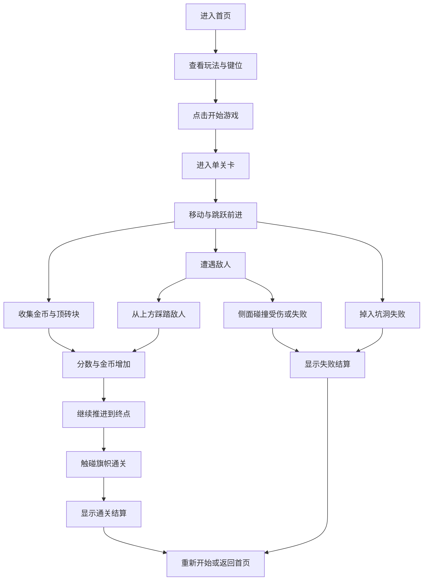

## 1. 产品概述
这是一个可在浏览器直接运行的网页版马里奥风格横版闯关游戏，聚焦单关卡、经典踩踏、顶砖块、收集金币和到达终点旗帜的完整游玩闭环。
- 主要解决“快速体验经典平台跳跃玩法”的需求，目标用户是喜欢复古游戏、网页小游戏和前端交互体验的玩家。
- 产品价值在于用现代 Web 技术复刻高辨识度的经典玩法，兼顾可玩性、视觉表现和前端演示价值。

## 2. 核心功能

### 2.1 用户角色
本产品无需区分复杂角色，所有访问者均可直接开始游戏。

| 角色 | 进入方式 | 核心权限 |
|------|----------|----------|
| 玩家 | 打开网页 | 开始游戏、控制角色、暂停重开、查看得分与结果 |

### 2.2 功能模块
1. **首页/开始界面**：游戏标题、开始按钮、玩法说明、键位提示、视觉氛围展示。
2. **游戏主界面**：角色控制、物理碰撞、敌人巡逻、金币收集、砖块互动、镜头跟随、状态 HUD。
3. **结算弹层**：通关/失败反馈、分数统计、重新开始、返回首页。

### 2.3 页面详情
| 页面名称 | 模块名称 | 功能描述 |
|-----------|----------|----------|
| 首页/开始界面 | 标题区 | 展示“网页版马里奥”主题标题、像素风副标题与开始按钮 |
| 首页/开始界面 | 玩法说明 | 展示移动、跳跃、踩敌人、收集金币、到达旗帜等说明 |
| 首页/开始界面 | 键位提示 | 提示 `A/D` 或方向键移动，`W/Space` 跳跃，`P` 暂停 |
| 游戏主界面 | 游戏画布 | 承载 tile 地图、角色、敌人、金币、砖块、旗帜与镜头滚动 |
| 游戏主界面 | 角色系统 | 提供左右移动、跳跃、重力、落地判定、受伤/死亡逻辑 |
| 游戏主界面 | 交互系统 | 支持踩敌人击败、侧碰受伤、顶砖块出金币、收集金币加分 |
| 游戏主界面 | 关卡系统 | 提供单关地图、地面/坑洞/平台/砖块布局与终点判定 |
| 游戏主界面 | HUD 状态栏 | 展示剩余生命、金币数、分数、计时器、暂停状态 |
| 游戏主界面 | 音效与反馈 | 提供跳跃、吃金币、顶砖、击败敌人、失败与通关反馈 |
| 结算弹层 | 结果展示 | 根据失败或通关展示状态、统计成绩与操作引导 |
| 结算弹层 | 二次操作 | 支持重新开始当前关卡或回到开始界面 |

## 3. 核心流程
玩家进入首页后阅读说明并开始游戏，进入单关卡后通过键盘控制角色向右推进，期间需要跳跃跨越障碍、踩踏敌人、顶砖块和收集金币；角色失足掉落或碰撞敌人会损失生命或直接失败，到达终点旗帜则通关并进入结算。

## 4. 用户界面设计
### 4.1 设计风格
- 主色调：天空蓝、草地绿、砖块橙棕、金币金黄，配以高对比像素描边
- 按钮风格：像素风立体按钮，带内阴影、外描边和按压位移反馈
- 字体与字号：标题使用具有复古街机感的像素展示字体，正文使用清晰的像素体或等宽体
- 布局风格：桌面优先，首页为居中舞台式布局，游戏页以固定比例画布为核心并辅以浮层 HUD
- 图标/装饰建议：使用像素云朵、山丘、问号砖、金币、旗帜等高辨识度元素

### 4.2 页面设计概览
| 页面名称 | 模块名称 | UI 元素 |
|-----------|----------|----------|
| 首页/开始界面 | 标题区 | 大型像素标题、漂浮云朵、分层山丘背景、轻微上下浮动动画 |
| 首页/开始界面 | 交互区 | 高对比开始按钮、玩法说明卡片、键位芯片、悬停发光反馈 |
| 游戏主界面 | 游戏画布 | 横向卷轴像素地图、角色与敌人精灵、砖块敲击动画、金币闪烁效果 |
| 游戏主界面 | HUD 状态栏 | 顶部像素信息条，展示金币、分数、生命、计时并保持清晰易读 |
| 结算弹层 | 结果卡片 | 半透明暗幕、像素边框卡片、结果标题、统计数据与两个操作按钮 |

### 4.3 响应式设计
- 采用桌面优先设计，优先保证 PC 键盘操作的手感和画布完整视野。
- 在窄屏设备上自适应缩放游戏容器，保持核心 HUD 可见并减少装饰层级。
- 支持触摸设备的基础提示展示，但首版以键盘操作为主，不强制实现虚拟按键。
