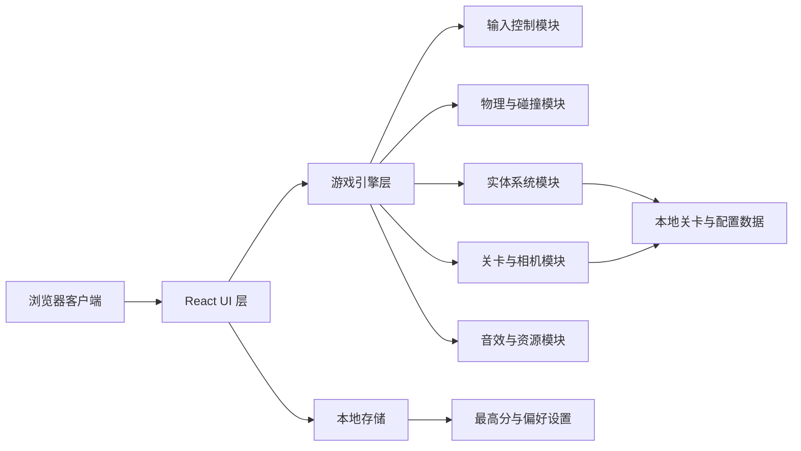
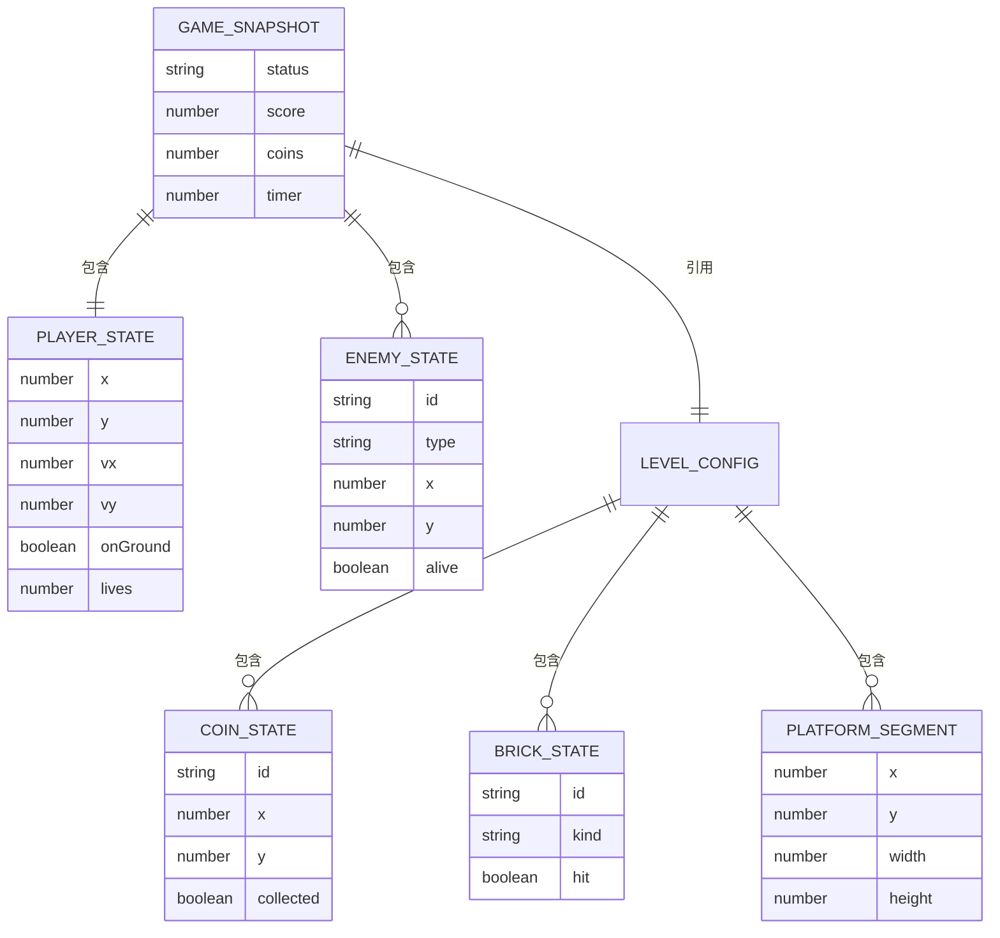

## 1. 架构设计


## 2. 技术描述
- 前端：React 18 + TypeScript + Vite
- 样式：Tailwind CSS 3 + 自定义像素风 CSS 变量与动画
- 游戏循环：`requestAnimationFrame`
- 渲染方式：DOM HUD + Canvas 2D 游戏主场景
- 状态管理：React 局部状态 + 自定义 `useGameEngine` Hook
- 数据来源：本地静态关卡配置、实体参数和音效映射
- 后端：无，首版纯前端实现
- 存储：`localStorage` 用于保存最高分和音量/偏好设置

## 3. 路由定义
| 路由 | 用途 |
|------|------|
| / | 游戏首页与开始界面 |
| /game | 游戏主界面，承载关卡与 HUD |

## 4. API 定义
本项目首版无独立后端 API，核心数据由前端本地模块提供。

```ts
export type GameStatus = "idle" | "running" | "paused" | "won" | "lost";

export interface PlayerState {
  x: number;
  y: number;
  vx: number;
  vy: number;
  width: number;
  height: number;
  facing: "left" | "right";
  onGround: boolean;
  lives: number;
  invincibleMs: number;
}

export interface EnemyState {
  id: string;
  type: "goomba";
  x: number;
  y: number;
  vx: number;
  width: number;
  height: number;
  alive: boolean;
}

export interface CoinState {
  id: string;
  x: number;
  y: number;
  collected: boolean;
}

export interface BrickState {
  id: string;
  x: number;
  y: number;
  kind: "question" | "solid";
  hit: boolean;
}

export interface LevelConfig {
  width: number;
  height: number;
  tileSize: number;
  groundSegments: Array<{ x: number; y: number; width: number; height: number }>;
  platforms: Array<{ x: number; y: number; width: number; height: number }>;
  pits: Array<{ x: number; width: number }>;
  enemies: EnemyState[];
  coins: CoinState[];
  bricks: BrickState[];
  flag: { x: number; y: number; height: number };
}

export interface GameSnapshot {
  status: GameStatus;
  score: number;
  coins: number;
  timer: number;
  player: PlayerState;
  enemies: EnemyState[];
  level: LevelConfig;
}
```

## 5. 数据模型
### 5.1 数据模型定义


### 5.2 数据定义说明
- `LevelConfig` 作为单关卡静态配置，描述地形、平台、敌人、金币、砖块和旗帜位置。
- `GameSnapshot` 作为运行时快照，供渲染层、HUD 和结算逻辑消费。
- `PlayerState` 维护角色运动学状态、方向、生命和短暂无敌时间。
- `EnemyState` 首版仅实现蘑菇怪巡逻逻辑，后续可扩展更多敌人类型。
- `localStorage` 仅保存 `bestScore`、`masterVolume`、`lastPlayedAt` 等轻量数据，无复杂持久化需求。

## 6. 模块拆分
- `pages/HomePage`：开始界面、玩法说明和进入游戏入口。
- `pages/GamePage`：承载游戏场景、HUD、暂停层与结算层。
- `components/GameCanvas`：封装 Canvas 渲染与尺寸同步。
- `components/GameHud`：展示分数、金币、生命与计时。
- `components/OverlayPanel`：复用暂停、失败、通关弹层。
- `game/useGameEngine`：统一管理循环、输入、状态推进和事件分发。
- `game/physics`：重力、速度更新、AABB 碰撞与落地判定。
- `game/entities`：玩家、敌人、金币、砖块、旗帜的初始配置与行为更新。
- `game/level`：关卡静态配置和重置逻辑。
- `game/audio`：音效资源加载与播放控制。

## 7. 实现要点
- 采用固定逻辑帧步长与 `requestAnimationFrame` 结合，降低不同设备上的物理差异。
- 使用简单 AABB 碰撞处理平台、砖块、敌人踩踏和金币收集，保证首版稳定性。
- 镜头以玩家 x 轴位置为中心平滑跟随，并限制在关卡边界内。
- Canvas 负责高频游戏渲染，React 仅处理低频 UI 和状态展示，避免重复渲染造成卡顿。
- 资源以 CSS 像素块、Canvas 绘制和少量本地音效为主，减少素材依赖并提升可控性。
